<p >
  
</p>

# wks-deployment

Hasta ahora hemos trabajado siempre en nuestro `localhost`, es decir, accedemos desde el browser a recursos que están en nuestra propia compu:

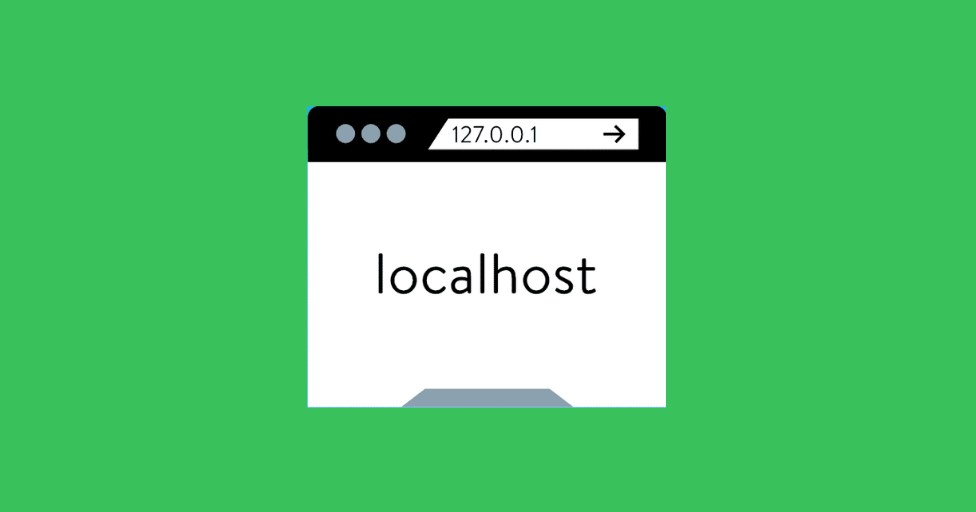

Esto quiere decir que sólo nosotros, y aquellos que estén conectados a nuestra misma red (por ejemplo: otra compu conectada en nuestra casa), van a poder acceder a los recursos que tengamos servidos -por ejemplo, nuestra API-.


En la imagen vemos una red LAN (Local Area Network) típica de una casa. Dentro de la red tenemos varios dispositivos conectados. Imaginemos que nuestra compu tiene corriendo un servidor web hecho en Node en el puerto `8080`.

Nosotros accedemos a la compu através de la URL `http://localhost:8080`.


`localhost` es un nombre que se le da por defecto a la dirección IP `127.0.0.1`, que es una dirección que apunta a nuestro propio host -nuestra compu-.
Por lo tanto cuando escribimos: `http://localhost:8080` estamos accediendo a nuestra propia compu al puerto 8080.


Bien, ahora si quisieramos acceder a nuestro server desde otro dispositivo, por ejemplo: un celular, tendríamos que conocer la dirección IP de nuestra compu -la que tiene el server corriendo- y acceder a esa IP y al puerto donde está escuchando:

`http://192.168.0.21:8080`

Genial, logramos acceder al servidor desde cualquier dispositivo conectado en la misma red. Ahora podríamos servir una página web o una app desde nuestro host para quienes vivan en casa.

> [Como conocer la dirección IP de tu compu](https://computerhoy.com/paso-a-paso/internet/como-saber-cual-es-direccion-ip-mi-ordenador-24347)

## Accediendo desde otras redes

Bien, ahora seguro se preguntarán: ¿Cómo hago si quiero que alguien que no esté en mi misma red se conecte a mi web?

Para esto es necesario contar con un servidor con una **IP pública**. Es decir una dirección IP que no cambie nunca y única que haya sido asiganda a nuestro server.

Las **IP privadas**, en cambio, se pueden repetir ya que son usadas internamente dentro de redes domésticas o privadas. De hecho, las IPs públicas usadas para este tipo de redes son las siguientes:

- 10.0.0.0 a 10.255.255.255
- 172.16.0.0 a 172.31.255.255
- 192.168.0.0 a 192.168.255.255
- 169.254.0.0 a 169.254.255.255

Seguramente en sus casas tengan alguna de esas direcciones por defecto!!

## Obteniendo un servidor con IP Publica

Ya sabemos que para poder hacer accesible nuestra App o web a todo el mundo necesitamos una IP publica, para esto vamos a tener que contratar los servicios de algún hosting. Justamente, estos servicios ofrecen la posibilidad de contratar un host virtual en la nube con una IP pública.

Hay muchas empresas que ofrecen lo mismo, y de distintos sabores: Algunos venden una máquina virtual directamente, otros un servicio donde subis el código y ellos se encargan de servirlo, etc...

Nosotros vamos a contratar los servicios de Digital Ocean, que ofrece un periódo de prueba gratis de 60 días.
Tambien podemos usar otros como AWS (tambien es gratis, pero te piden que ingreses tarjeta de crédito), o Heroku (este última no te da una máquina virtual, si no que podemos subir tu código y ellos lo ejecutan).

## Deployando en Digital Ocean

Para empezar vamos a crear una cuenta en Digital Ocean con este [link](https://m.do.co/c/b8d991ae6580).


Les debería llegar un email con un link de confirmación a la cuenta con la que se registraron!
Una vez confirmado su email deberán ingresar una tarjeta de crédito o cuenta de PayPal para acceder al free trial.

> AWS tambien exige poner la Tarjeta de crédito para obtener el free trial, de todos modos no te cobran nada.

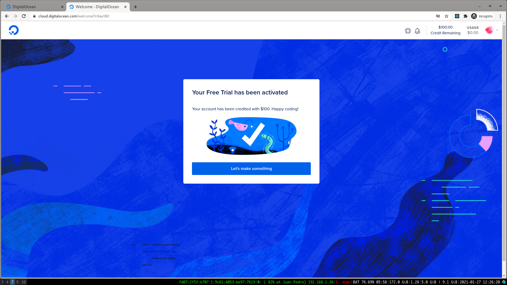

Una vez confirmada la TC verán la confirmación que tienen su crédito. Si hacen click en el botón van a pasar a una ventana de Welcome que vamos a saltear, para ir al panel de control.

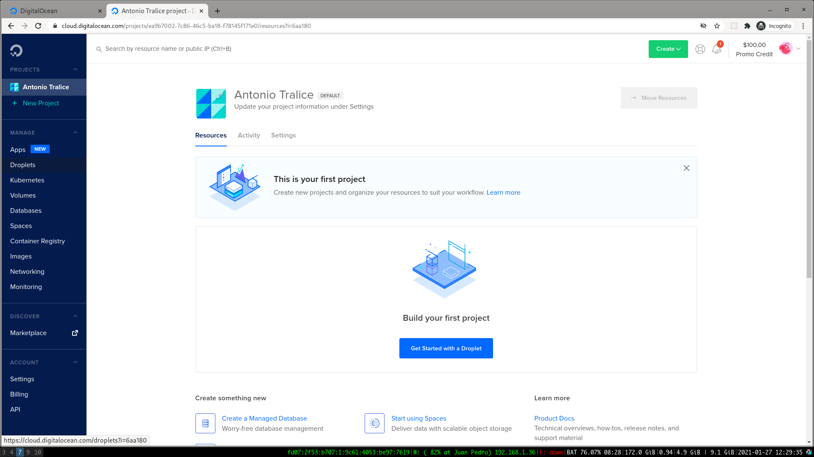

Dentro del panel, vamos a ir a la sección de `Droplets` que es la forma de Digital Ocean de llamarle a una máquina virtual (VPS -Virtual Private Server).
Dentro de Droplets vamos a clickear en `Create Droplet`.

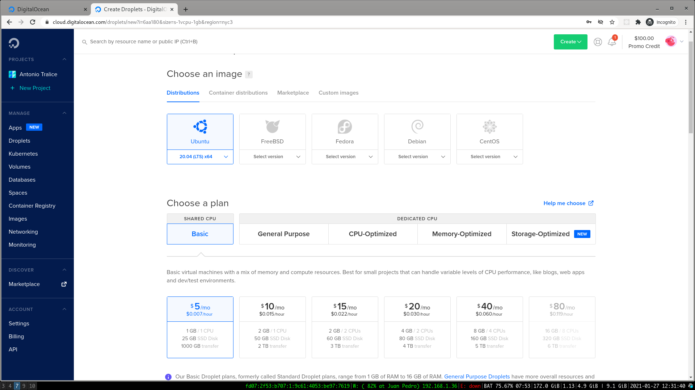

En esta pantalla vamos a ver que podemos configurar nuestra máquina virtual. Podemos elegir el sistema operativo, y tambien las prestaciones de hardware.Mientras mayor prestaciones (más CPU, más disco, etc...) será más caro el alquiler que tengamos que pagar.

Vamos a seleccionar Ubuntu y la máquina más barata.


Ahora vamos a configurar nuestra password y el nombre del host para luego poder conectarnos a traves de internet a nuestra compu virtual!

Finalmente vamos abajo de todo y creamos el droplet. (Digital Ocean ofrece el servicio de Back ups, o de redes privadas y de storage, pero para nuestro ejercicio no es necesario, y no son gratis!).

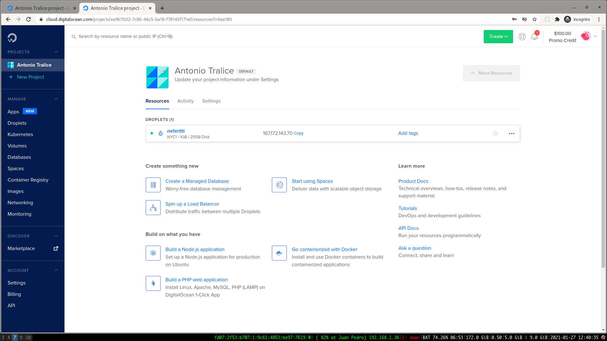

Genial! Ya tenemos nuestro propia máquina virtual que vamos a usar como servidor web. De hecho, ya podemos visualizar la dirección **IP pública** que nos asignaron. Cuando ingresemos a nuestro server, vamos a hacerlo a través de esa IP.

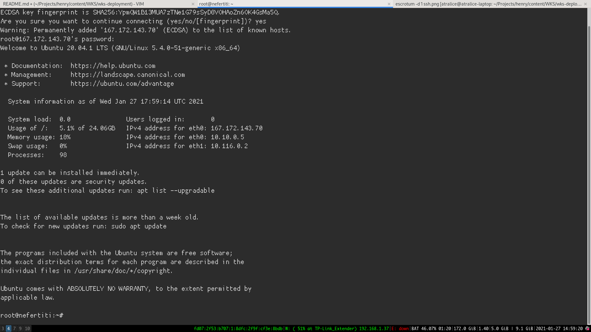

> Para conectarse a la terminal (consola) del host remoto -nuestra máquina virtual- vamos a usar el comando `ssh`. Como argumentos le pasamos el siguiente querystring: `{usuario}@{ip}`. En este caso el user es `root`, y la `ip` la del server -que vimos más arriba en el dashboard de Digital Ocean-.

> Los que tienen windows pueden usar el [putty](https://www.putty.org/) para conectarse. Acá una [guía](https://www.digitalocean.com/docs/droplets/how-to/connect-with-ssh/putty/) paso a paso.

### Dentro de nuestra máquina virtual

Bien, ahora que estamos dentro de nuestro host, vamos a poder instalar el mismo software cómo lo haciamos en nuestra compu y ejecutarlo. Es decir que tenemos que instalar `node` y `npm`, instalar las dependecias (tambien instalar la Base de datos si necesitamos una, etc...).

#### Node y NPM

Recordemos que en este host tenemos instalado Ubuntu 20.04. Una buena forma para instalar `node` y `npm` es a través de `node version manager` (nvm). Para instalarlo escribimos el siguiente comando: 

`curl -o- https://raw.githubusercontent.com/nvm-sh/nvm/v0.35.3/install.sh | bash`

Esto va a instalar `nvm` en nuetro host. Ahora para poder usarlo debemos escribir el siguiente comando:

`source ~/.bashrc`

Ahora tenemos disponible el comando `nvm` que nos sirve para gestionar versiones de node, vamos a instalar la última versión estable:

`nvm install --lts`

Si escribimos `node -v` y vemos la versión, entonces ya tenemos instalado node!


Genial! Ahora ya tenemos Node en el server, para probarlo vamos a correr el siguiente server básico en Node y ejecutarlo:
Creamos el archivo server.js:

```js
const http = require('http');

http.createServer(function (req, res) {
  res.write('Hola, Mundo!');
  res.end();
}).listen(8080);
```

Y lo ejecutamos: `node server.js`

Ahora vamos a la **IP Pública** de nuestro server desde el browser -no olvidar el puerto donde pusimos a escuchar al server-:

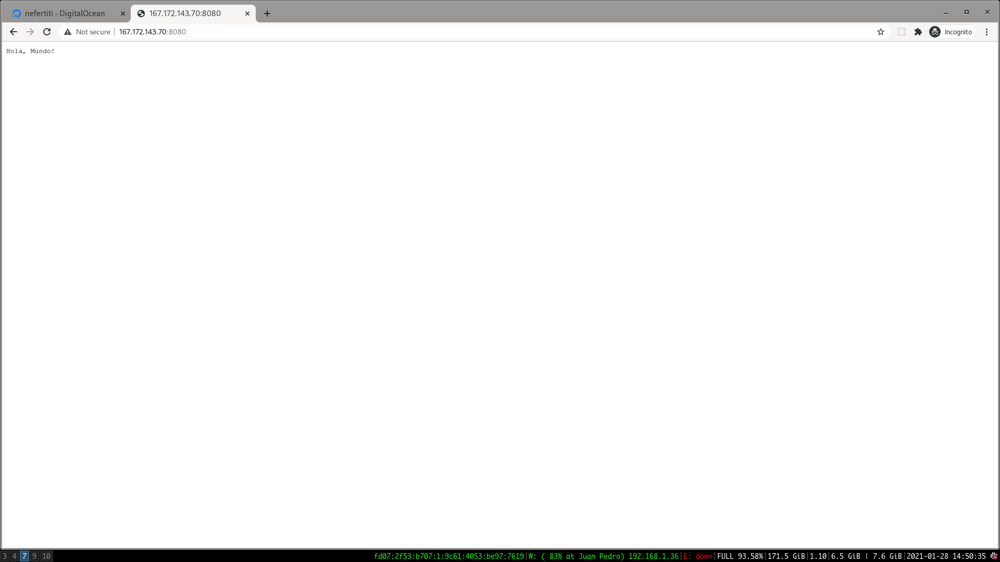

Genial!
Ahora a quien sea que le compartas esa dirección va a poder ingresar a tu server!

# NGINX


**NGINX** es un servidor web muy usado en internet, muchos grandes sitios y plataformas son servidos usando este software. Nginx está codeado en C, y si bien es un servidor web de archivos estáticos, es muy usando como un *load balancer* y *reverse proxy*.

En este workshop vamos a aprender a instalar y configurar *NGINX* en un host con ubuntu (el droplet que hicimos en la primera parte) y vamos a usarlo para:
- Servir contenido estático: Por ejemplo, una web en REACT.
- Como reverse proxy, para apuntar a un servidor escrito en Node.


## Instalando NGINX

Primero, vamos a conectarnos a nuestra instancia de *Digital Ocean* usando `ssh`.
Una vez adentro, vamos a instalarlo usando el gestor de paquetes de ubuntu:

```bash
sudo apt update
sudo apt install nginx
```

> La forma de instalar `nginx` dependerá del sistema operativo donde estes trabajando, en este caso estamos usando el droplet que tiene Ubuntu.

### Firewall

Por cuestiones de seguridad, los servidores en la nube no tienen "abierto" todos los puertos. Es decir, que puede ocurrir que tengamos nuestra aplicación o programa *escuchando* en, por ejemplo, el puerto `3000`; pero que ese puerto no este *abierto* en el **firewall**, por lo tanto las conexiónes de afuera que lleguen a ese puerto no funcionarían- dando la sensación que el server está caído, cuando en realidad está funcionando, pero es inaccesible-.

Por lo tanto, vamos a asegurarnos que el puerto `80` este abierto en nuestro server. En ese puerto va a estar escuchando `nginx`.
En la consola tiramos el siguiente comando: `sudo ufw app list`.

```bash
root@nefertiti:~# sudo ufw app list

Available applications:
  Nginx Full
  Nginx HTTP
  Nginx HTTPS
  OpenSSH
```

El output son las configuraciones por defecto que ofrece cada aplicación, en este caso: 

* **Nginx Full**: Esta config abre el puerto `80` (http por defecto) y el puerto `443` (https).
* **Nginx HTTP**: Esta abre el puerto `80` solamente.
* **Nginx HTTPS**: Esta abre solo el puerto `443`.
* **OpenSSH**: Abre el puerto para poder conectarnos a través de `ssh`.

En este caso vamos activar el perfil `Nginx HTTP` y `OpenSSH`, ya que sólo usaremos el puerto `80`, y tambien queremos dejar el puerto de `ssh` abierto para poder acceder al host.

> En caso de dudas, siempre elegir la configuración más restrictiva.

Para activar los dos perfiles hacemos estos dos comandos:

```bash
$ sudo ufw allow "OpenSSH"
$ sudo ufw allow "Nginx HTTP"
```

Finalmente, nos falta activar el firewall:

```bash
root@nefertiti:~# sudo ufw enable
Command may disrupt existing ssh connections. Proceed with operation (y|n)? y
Firewall is active and enabled on system startup
root@nefertiti:~#
```

Genial! Ya disponemos de los puertos abiertos!

### Nginx funcionando

Bien, ahora vamos a chequear que `nginx` esté corriendo en nuestro host, para eso tiramos el comando: `systemctl status nginx`. Si vemos el siguiente output quiere decir que esta corriendo correctamente.

```bash
root@nefertiti:~# systemctl status nginx
● nginx.service - A high performance web server and a reverse proxy server
     Loaded: loaded (/lib/systemd/system/nginx.service; enabled; vendor preset: enabled)
     Active: active (running) since Wed 2021-02-03 16:31:25 UTC; 21h ago
       Docs: man:nginx(8)
   Main PID: 1881 (nginx)
      Tasks: 2 (limit: 1137)
     Memory: 28.9M
     CGroup: /system.slice/nginx.service
             ├─1881 nginx: master process /usr/sbin/nginx -g daemon on; master_process on;
             └─1882 nginx: worker process
```

Genial, ahora si accedemos a la `ip pública` de nuestro host, al puerto 80, vamosa  ver la página por defecto que sirve `nginx`:

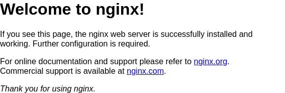

:clap: :clap:
Ya tenemos nuestro `web server` sirviendo una página estática.

### Configurando Nginx

El próximo paso es configurar `nginx` para poder servir nuestra propia página. Para eso vamos a armar una página con `React` y vamos a deployarla.

Recuerdan que el proceso de *bundelear* un proyecto de React -usando `webpack`- termina dejando el output en una carpeta que generalmente se llama `publi`. Bien, esa carpeta es la que tiene todos los archivos estáticos que queremos servir.

Vamos a crear una nueva app en react:

```bash
root@nefertiti:~# npx create-react-app my-app
root@nefertiti:~# cd my-app
root@nefertiti:~# npm start
```

Ahora nuestra app esta corriendo en el server de desarrollo en el puerto `3000`.

> En este caso, `create react app` nos da por defecto un mini servidor web en Node que sirve los archivos estáticos. Esto sirve para el desarrollo ya que es rápido y podemos ver el resultado de lo que hacemos. Ahora vamos a pasarlo a `nginx` que nos sirve para produción, ya que es mucho más rápido que node para servir archivos estáticos.

Bien, si intentamos entrar a nuestra ip al puerto `3000` desde el browser deberíamos ver nuestra app:

```
http://167.172.143.70:3000/
```

> reemplazen la `ip` con la `ip pública` de su host.

:angry: vamos a ver que no podemos acceder!! Por qué? porque no tenemos el puerto `3000` abierto en el firewall!!

Vamos a cerrar el server con `ctrl + c` y vamos a abrir el puerto `3000`:

```bash
root@nefertiti:~/my-app# sudo ufw allow 3000
Rule added
Rule added (v6)
root@nefertiti:~/my-app#
```

Ahora levantamos el server de nuevo y probamos: `npm start`, si entramos de nuevo desde el browser deberíamos ver nuestra app corriendo:

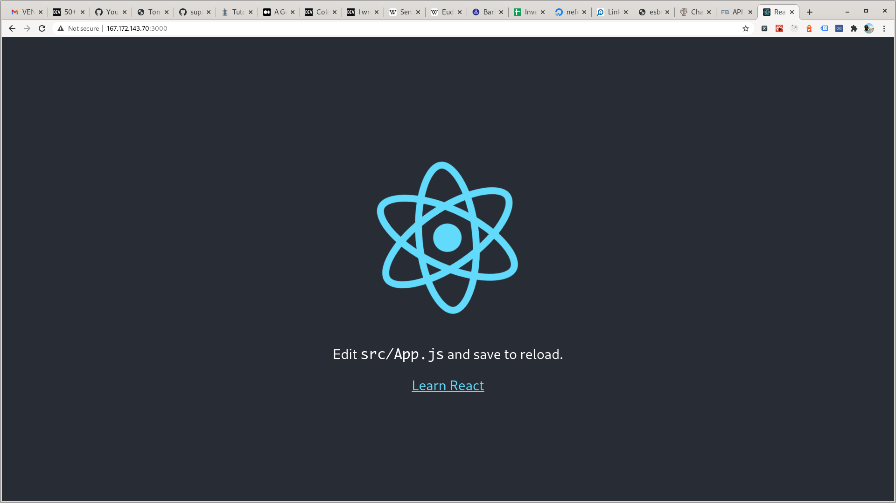

### Deployando el build de producción

Ahora vamos a `buildar` nuestro proyecto, es decir, vamos a decirle a `webpack` que haga su magia, y nos deje todo lo estático en un bundle en la carpeta por defecto. Para eso frenamos la ejecución del server dev (siempre con `ctrl + c`) y ejecutamos le siguiente comando:

```bash
root@nefertiti:~/my-app# npm run build

> my-app@0.1.0 build /root/my-app
> react-scripts build

Creating an optimized production build...
Compiled successfully.

File sizes after gzip:

  41.33 KB  build/static/js/2.a4a16643.chunk.js
  1.59 KB   build/static/js/3.8b397b65.chunk.js
  1.17 KB   build/static/js/runtime-main.2d881af2.js
  591 B     build/static/js/main.71923c8e.chunk.js
  531 B     build/static/css/main.8c8b27cf.chunk.css

The project was built assuming it is hosted at /.
You can control this with the homepage field in your package.json.
```

Si todo salió bien, veremos el output anterior y ya tendremos nuestro archivos estáticos en la carpeta `build`:

```bash
root@nefertiti:~/my-app# cd build/
root@nefertiti:~/my-app/build# ls
asset-manifest.json  favicon.ico  index.html  logo192.png  logo512.png  manifest.json  robots.txt  static
```

Ahora vamos a configurar Nginx para poder servir esos archivos en el puerto `80`.

### Configurando Nginx

Nginx funciona a base de unos archivos de configuración, en estos archivos le indicamos al servidor qué cosa queremos servir, donde están esas cosas y varias configuraciones más.

> `Nginx` se puede usar de muchisimas maneras distintas, y el archivo de configuración puede volverse complicado, en este workshop aprenderemos a usarlo de la manera más simple. Si les gusta y quieren aprender más, internet está lleno de tutoriales para aprender a manejar. Es un skill que suma mucho saber usar `nginx`.

Primero vamos a crear un archivo de configuración nuevo en la carpeta correspondiente (nginx busca los archivos en esa carpeta por defecto):

```bash
sudo nano /etc/nginx/sites-available/react
```

Dentro del archivo copiaremos lo siguiente:

```
server {
   server_name 167.172.143.70;
   root /root/my-app/build;
   index index.html index.htm;
   location / {
      try_files $uri /index.html =404;
   }
}
```
Acá estamos poniendo:

* `server_name`: Indicamos con qué nombre van a llegar los request, puede ser nuestra IP o nuestro dominio si tuvieramos uno, por ejemplo: `prueba.soyhenry.com`.
* `root`: Path completo donde se encuentran los archivos que queremos servir.
* `index`: El archivo que tiene que servir por defecto, cuando entren a la URL del server. En general es el `index.html`.
* `location`: Esta es una directiva para decirle a `nginx` que tiene que servir cuando llegue un request, le estamos diciendo que sirva lo que sea que llegue en la `url`, por ejemplo si ponen `/ejemplo.html`, que sirva el archivo `ejemplo.html`, si no, que sirva `index.html` por defecto, y si no, que tire un 404.

> Para pegar en la terminal es probable que tenga que usar `ctrl + shift + v`, dependiendo de sus sistema operativo.

Vamos a cerrar el archivo nuevo y grabar con `ctrl + x` y luego `yes`.

Ahora con este comando: `sudo ln -s /etc/nginx/sites-available/react /etc/nginx/sites-enabled` vamos a crear una [`enlace simbólica`](https://hipertextual.com/archivo/2014/07/enlaces-fisicos-y-simbolicos-linux/) de nuestro archivo en otra carpeta de nginx (Nginx permite tener archivos de configuración que no están activos -desarrollo- y tener los productivos -postas-, para eso tiene dos carpetas).

Por último tenemos que configurar los permisos para que el proceso de `nginx` pueda acceder a los archivos de `/build`:

```bash
root@nefertiti:~/my-app# chown www-data -R /root/
```

> Los permisos de linux son [todo un tema](https://blog.desdelinux.net/permisos-y-derechos-en-linux/), no nos preocupemos por eso ahora!

Bien, ahora podemos reiniciar nginx: 

```bash
root@nefertiti:~/my-app# sudo systemctl restart nginx
root@nefertiti:~/my-app# 
```

Si todo salió bien, podemos ir a la url de nuestra ip y ver nuestra página deployada:

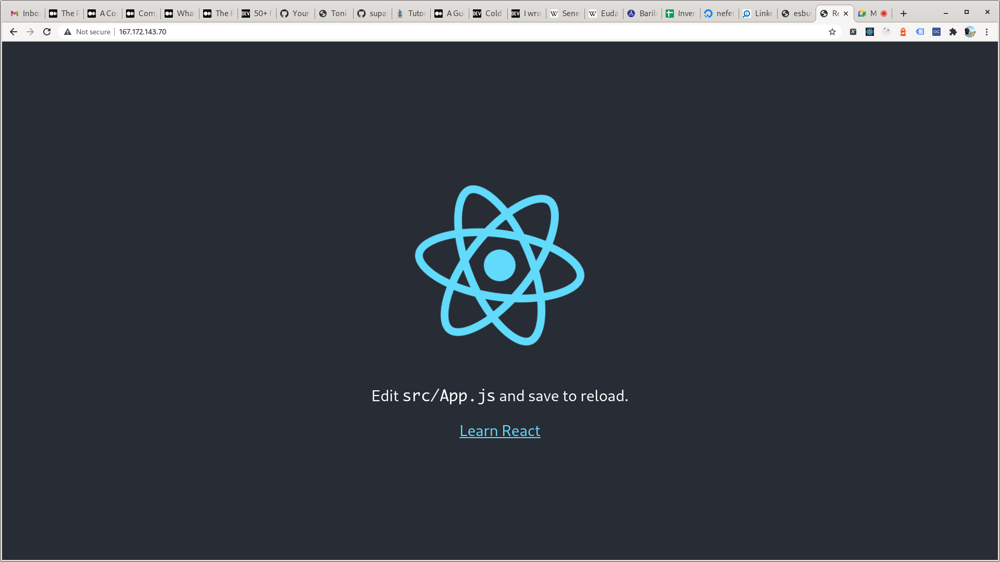

# Nginx Reverse Proxy

Por último, vamos a usar `nginx` para desviar el trafico que llega a `http://{tu-ip}/api` al server de Node, que podría estar corriendo en el puerto `300`.

Lo interesante de esto, es que todos los request van al mismo *dominio* (en este caso, ip) pero vamos a poner la regla que si el recurso es `/api` entonces sea redireccionado a Node. De esta forma, no vamos a tener problemas de `CORS`, y el acceso al server es por un único punto.

## Levantando nuestra API

Primero, vamos a crear una API simple en node, y la vamos a dejar corriendo en e `background`, para eso, vamos a usar un módulo de `npm` llamado `pm2`.

```bash
npm install pm2 -g
```

`PM2` es un paquete de npm que vamos a instalar de manera global (parametro `-g`), para poder ejecutarlo como un comando del sistema operativo.
Este comando recibe como argumento un archivo de javascript (`index.js` por ejemplo), y se encarga de ejecutarlo, pero lo que tiene de particular es que lo ejecuta en el background, es decir que vamos a recobrar control de la terminal. Además, si hubiera un error en el programa de node, `PM2` se encarga de reiniciarlo automáticamente (ojo con el `sync: true`).

Vamos a ejecutar el archivo `server.js` que habíamos creado más arriba con `PM2`:

```bash
pm2 start server.js
```

si vemos este output, quiere decir que todo salió bien!

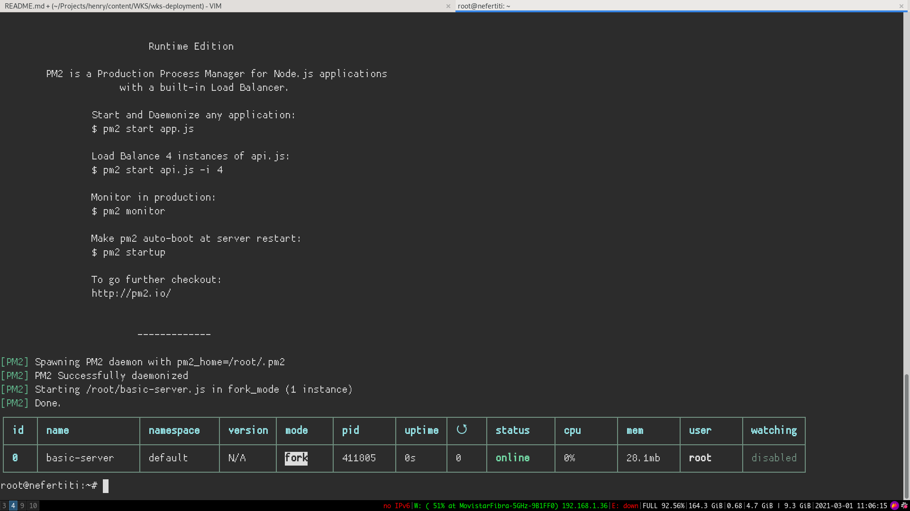

Bien, ahora si intentamos acceder a nuestra api usando : `{nuestra-IP}:8080` (en mi caso: `10.116.0.2:8080`), vamos a ver que no podemos ingresar!!!
Esto es porque habíamos cerrado todos los puertos, menos el `80`.

¿Cómo hacemos para ingresar a una api servida en el puerto `8080` si sólo tenemos abierto el puerto `80` por seguridad?
Para resolver esto, vamos a usar `nginx` como **REVERSE PROXY**. Es decir, vamos a poner una regla que diga lo siguiente:

* Todo el tráfico que llegue a `{nuestra-ip}/api` será redireccionado *internamente* al puerto 8080.

Para eso vamos a editar nuestro archivo de configuración del server de nginx (/etc/nginx/sites-available/react):

```
server {
	server_name 167.172.143.70;
	root /root/my-app/build/;
	index index.html index.htm;
	location / {
 		try_files $uri /index.html =404;
 	}

	location /api {
		proxy_pass http://127.0.0.1:8080;
	}
}
```

Con location le decimos a nginx que esa regla es válida para todo lo que llegue a `/api` (parecido a `express`, no?). Y dentro le decimos que haga un `proxy_pass` a una nueva dirección. O sea, que redireccione el request a otro lugar, ese lugar es la ip `127.0.0.1` y el puerto `8080` que es donde está escuchando nuestro server que levantamos con `pm2`!!

Si entramos desde el browser a `{nuestra-ip}/api` deberíamos ver lo que devuelve nuestra API de prueba!!

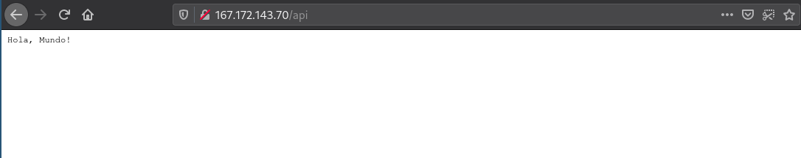


### HomeWork

Ahora que ya tenés las herramientas para deployar una app de Node en Digital Ocean, intentá deployar tu proyecto individual en un `droplet` y compartir ela IP con tus compañeros!

